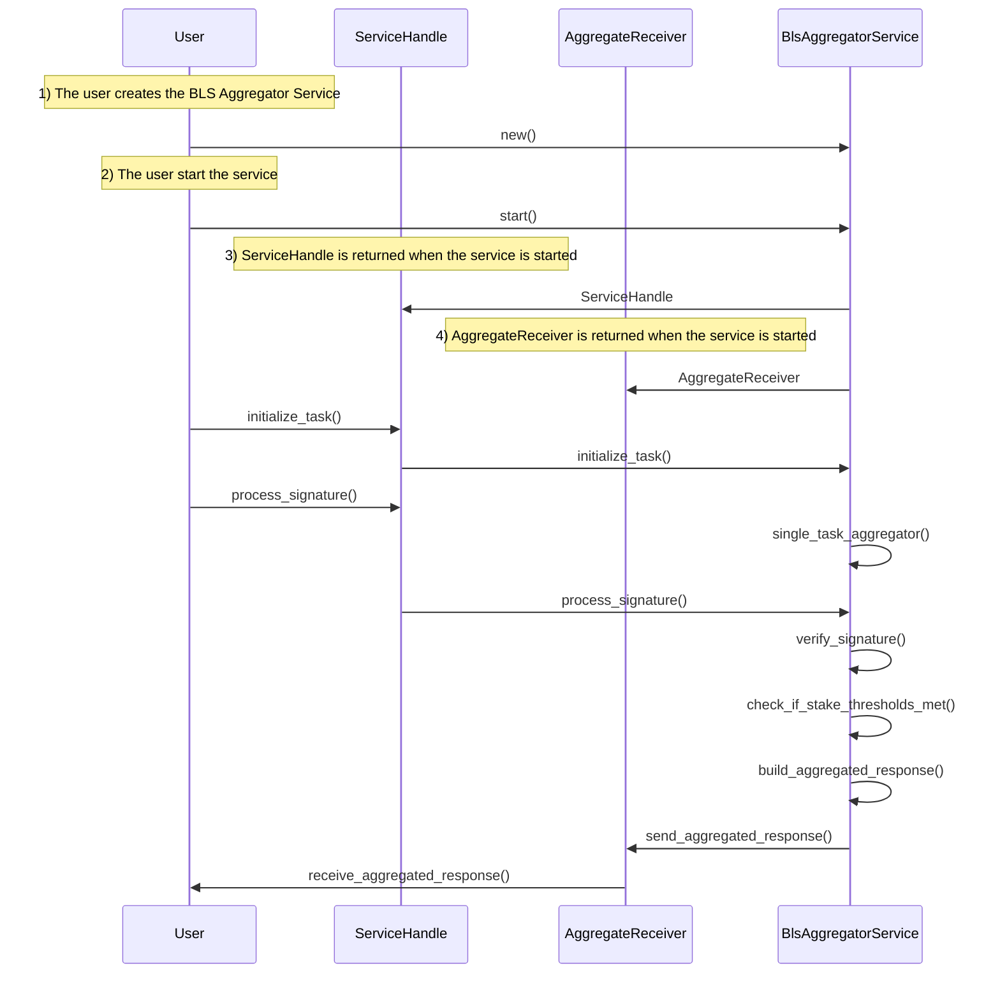

# Bls Aggregation Service

The BLS Aggregation Service provides functionality to aggregate BLS signatures from multiple operators into a single aggregated signature.

## Key Features

- **BLS Signature Aggregation**: Combines multiple individual signatures into a single verifiable aggregated signature.
- **Quorum Verification**: Ensures that the required participation threshold is reached for each quorum.
- **Task Management**: Allows initializing tasks and processing signatures for those tasks.
- **Configurable Time Window**: Allows defining waiting periods for signature collection.

## Main Components

### TaskMetadata

Defines the metadata for a task.

- `task_index`: Unique identifier for the task
- `task_created_block`: Block in which the task was created
- `quorum_numbers`: Quorum numbers that should respond to the task
- `quorum_threshold_percentages`: Threshold percentages for each quorum
- `time_to_expiry`: Time before the task response aggregation expires
- `window_duration`: Duration of the window to wait for signatures after quorum is reached

### TaskSignature

Represents an individual signature for a task.

- `task_index`: Index of the task
- `task_response_digest`: Digest of the task response
- `bls_signature`: BLS signature of the task response
- `operator_id`: ID of the operator that signed the response

### ServiceHandle

Represents a handle to interact with the BLS Aggregation Service.

- `msg_sender`: UnboundedSender to send messages to the BLS Aggregation Service

Provides methods to interact with the service:

- `initialize_task()`: Initializes a new task
- `process_signature()`: Processes a signature for a task

### AggregateReceiver

Represents a receiver to receive aggregated responses from the BLS Aggregation Service.

- `aggregate_receiver`: UnboundedReceiver to receive aggregated responses from the service

Allows receiving aggregated responses from the service:

- `receive_aggregated_response()`: Receives an aggregated response

### BlsAggregatorService

The main service that coordinates signature aggregation:

- `new()`: Creates a new instance of the service
- `start()`: Starts the BLS Aggregator Service running the main loop in background
- `run()`: Runs the main loop of the service

## Usage Example

Below is a basic example of how to use the BLS Aggregation Service:

