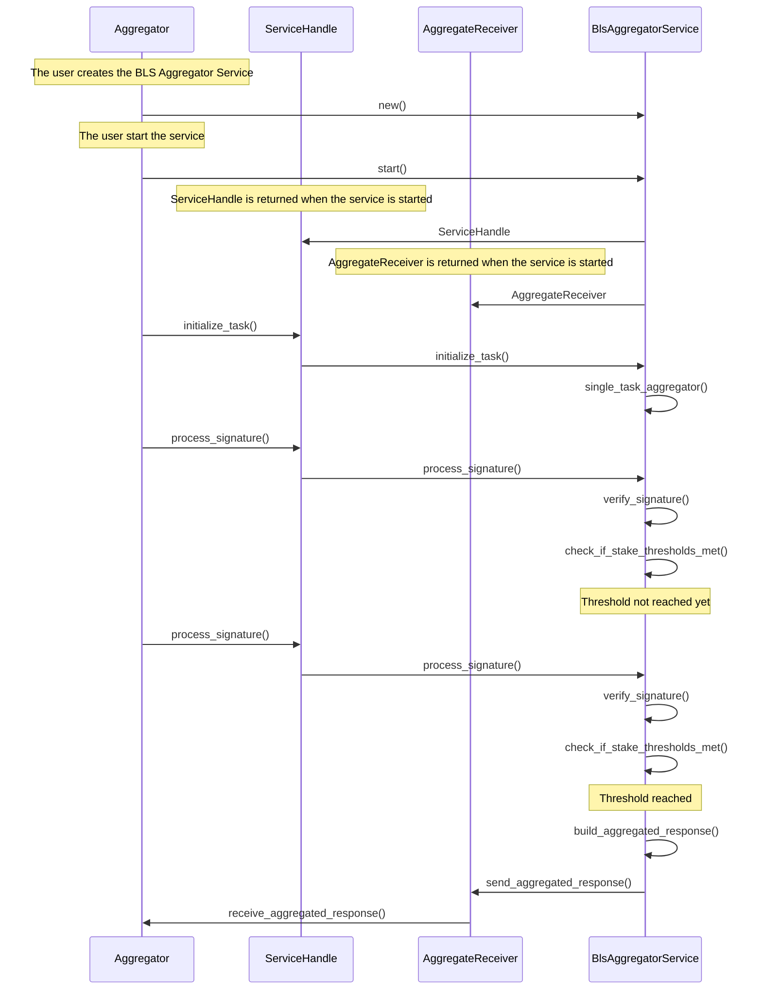

# BLS Aggregation Service


## Introduction

The BLS Aggregation Service provides functionality to aggregate BLS signatures from multiple operators into a single aggregated signature. This is used by the Aggregator to verify the signatures of the operators and send the aggregated response once the quorum is reached or time expires. 


The BLS Aggregation Service is primarily used by operators, who contribute signatures to task. AVS developers use it to define and manage tasks, set quorum requirements and integrate aggregated results into their smart contracts.

<!-- BAD --> [Example of a aggregation service in action](https://github.com/Layr-Labs/incredible-squaring-avs-rs/blob/dev/crates/aggregator/src/fake_aggregator.rs).


## Key Features

- **BLS Signature Aggregation**: Combines multiple individual signatures into a single verifiable aggregated signature.
- **Quorum Verification**: Ensures that the required participation threshold is reached for each quorum.
- **Task Management**: Allows initializing tasks and processing signatures for those tasks.
- **Configurable Time Window**: Allows defining waiting periods for signature collection.

## Main Components

### TaskMetadata

Defines the metadata for a task.

- `task_index`: Unique identifier for the task
- `task_created_block`: Block in which the task was created
- `quorum_numbers`: Quorum numbers that should respond to the task
- `quorum_threshold_percentages`: Threshold percentages for each quorum
- `time_to_expiry`: Time before the task response aggregation expires
- `window_duration`: Duration of the window to wait for signatures after quorum is reached

### TaskSignature

Represents an individual signature for a task.

- `task_index`: Index of the task
- `task_response_digest`: Digest of the task response
- `bls_signature`: BLS signature of the task response
- `operator_id`: ID of the operator that signed the response

### ServiceHandle

Represents a handle to interact with the BLS Aggregation Service.

- `msg_sender`: UnboundedSender to send messages to the BLS Aggregation Service

Provides methods to interact with the service:

- `initialize_task()`: Initializes a new task
- `process_signature()`: Processes a signature for a task

### AggregateReceiver

Represents a receiver to receive aggregated responses from the BLS Aggregation Service.

- `aggregate_receiver`: UnboundedReceiver to receive aggregated responses from the service

Allows receiving aggregated responses from the service:

- `receive_aggregated_response()`: Receives an aggregated response

### BlsAggregatorService

The main service that coordinates signature aggregation:

- `new()`: Creates a new instance of the service
- `start()`: Starts the BLS Aggregator Service running the main loop in background
- `run()`: Runs the main loop of the service

## Usage

When you initialize the BLS Aggregation Service, it returns a tuple of `ServiceHandle` and `AggregateReceiver`. The `ServiceHandle` is used to interact with the service. The available messages to send to the service are:

- `initialize_task()`: Initializes a new task. If you want to set a time to expiry for the task, you can use the `with_time_to_expiry()` method in a builder pattern.
- `process_signature()`: Processes a signature for a task

The `AggregateReceiver` is used to receive aggregated responses from the service.

Once a task is initialized, the service will start processing the task in a loop in the background. The service will wait for the quorum to be reached or the time to expire. Once the quorum is reached or the time expires, the service will aggregate the signatures and send the aggregated response to the `AggregateReceiver`.

### Initialize the Service

```rust
let (service_handle, aggregate_receiver) = BlsAggregatorService::new(avs_registry_service, logger).start();
```

### Initialize a Task

```rust
let metadata = TaskMetadata::new(
    task_index,
    block_number,
    quorum_numbers,
    quorum_threshold_percentages,
    time_to_expiry,
));
service_handle.initialize_task().await?;
```

### Process a Signature

```rust
let task_signature = TaskSignature::new(
    task_index,
    task_response_digest,
    bls_sig_op_1.clone(),
    test_operator_1.operator_id,
)
handle.process_signature(task_signature).await?;
```

### Receive an Aggregated Response

```rust
match aggregate_receiver.receive_aggregated_response().await {
    Ok(aggregated_response) => {
        // Handle the aggregated response
    }
    Err(e) => {
        // Handle the error
    }
}
```

## Error Handling

The service returns a `BlsAggregationServiceError` if there is an error. The error can be one of the following:

| Error                              | Description                                                                 |
|-----------------------------------|-----------------------------------------------------------------------------|
| `BlsAggregationServiceError::TaskNotFound` | Task not found            |
| `BlsAggregationServiceError::SignatureVerificationError::OperatorNotFound` | Operator not found |
| `BlsAggregationServiceError::SignatureVerificationError::OperatorPublicKeyNotFound` | Operator public key not found for task index |
| `BlsAggregationServiceError::SignatureVerificationError::IncorrectSignature` | Incorrect signature |
| `BlsAggregationServiceError::SignaturesChannelClosed` | Signatures channel was closed, can't send signatures to aggregator |
| `BlsAggregationServiceError::ChannelError` | Error sending to channel |
| `BlsAggregationServiceError::RegistryError` | Registry Error |
| `BlsAggregationServiceError::DuplicateTaskIndex` | Duplicate task index error |


## Example Diagram

The following diagram shows the sequence of events when a user creates the BLS Aggregator Service, starts the service, and then initializes a task. The service processes two signatures from the operators and then aggregates them into a single aggregated signature.



## Testing

To run the integration tests, you can use the following command:

```bash
cargo test --package eigen-services-blsaggregation --lib -- bls_agg_test::integration_test --show-output 
```
